<!-- ====== ANIMATED HEADER ====== -->
<div align="center">


<!-- ====== TYPING ANIMATION ====== -->
<a href="https://github.com/affanlst">
  
</a>

<br/>

<!-- ====== ANIMATED WAVE GIF ====== -->


<br/>

<!-- ====== BADGES ====== -->
<p>
  
  
  
  
</p>

</div>

<!-- ====== DIVIDER ====== -->


<!-- ====== ABOUT ME ====== -->
<h2 align="center">
  
  &nbsp; About Me &nbsp;
  
</h2>


```typescript
const affan: Developer = {
    pronouns: ["He", "Him"],
    role: "Software Developer",
    location: "Indonesia 🇮🇩",
    
    passion: [
        "🌐 Web Development",
        "🔌 IoT & Embedded Systems",
        "🎨 UI/UX Design",
        "🧩 Problem Solving"
    ],
    
    currentlyLearning: [
        "Next.js 14 App Router",
        "Cloud Architecture",
        "System Design",
        "DevOps Practices"
    ],
    
    techStack: {
        frontend: ["React", "Next.js", "TailwindCSS"],
        backend: ["Node.js", "Express", "PHP"],
        database: ["MySQL", "Firebase", "MongoDB"],
        tools: ["Git", "VS Code", "Arduino"]
    },
    
    funFact: "I debug with console.log() and I'm not ashamed 😄",
    motto: "Code. Learn. Repeat. 🚀"
};
```

<br/>

- 🔭 I'm currently working on **exciting web & IoT projects**
- 🌱 I'm constantly exploring **new technologies and frameworks**
- 💬 Ask me about **JavaScript, React, Next.js, or Arduino**
- ⚡ Fun fact: **I love turning ideas into reality with code**
- 📫 Reach me anytime at the **contact section below** 👇

<br clear="right"/>

<!-- ====== DIVIDER ====== -->


<!-- ====== TECH STACK ====== -->
<h2 align="center">
  
  &nbsp; Tech Stack & Tools &nbsp;
  
</h2>

<div align="center">

### 💻 Languages
<p>
  
</p>

### ⚛️ Frameworks & Libraries
<p>
  
</p>

### 🗄️ Databases & Cloud
<p>
  
</p>

### 🔧 Tools & Platforms
<p>
  
</p>

### 🎨 Design & Collaboration
<p>
  
</p>

</div>

<!-- ====== DIVIDER ====== -->


<!-- ====== GITHUB STATS ====== -->
<h2 align="center">
  
  &nbsp; GitHub Statistics &nbsp;
  
</h2>

<div align="center">

<a href="https://github.com/affanlst">
  
  
</a>

<br/>


<br/><br/>


</div>

<!-- ====== TROPHIES ====== -->
<h2 align="center">
  
  &nbsp; GitHub Trophies &nbsp;
  
</h2>

<div align="center">
  
</div>

<!-- ====== SNAKE CONTRIBUTION ====== -->
<h2 align="center">
  
  &nbsp; Contribution Snake &nbsp;
  
</h2>

<div align="center">
  
</div>

<!-- ====== DIVIDER ====== -->


<!-- ====== CURRENT FOCUS ====== -->
<h2 align="center">
  
  &nbsp; Current Focus &nbsp;
  
</h2>

<div align="center">

| 🚀 **Building** | 📚 **Learning** | 🎨 **Exploring** |
|:---:|:---:|:---:|
| Full Stack Web Apps | System Design | UI/UX Design |
| IoT Projects | Cloud Architecture | Open Source |
| REST APIs | DevOps Practices | New Frameworks |
| Real-time Dashboards | Software Testing | Animation & Motion |

</div>

<!-- ====== DIVIDER ====== -->


<!-- ====== DEV JOURNEY ====== -->
<h2 align="center">
  
  &nbsp; My Dev Journey &nbsp;

```mermaid
graph LR
    A[🌱 Curious Beginner] --> B[💻 HTML/CSS/JS]
    B --> C[⚛️ React & Next.js]
    C --> D[🔥 Backend & APIs]
    D --> E[🗄️ Databases]
    E --> F[☁️ Cloud & DevOps]
    F --> G[🚀 Full Stack Developer]
    G --> H[🔮 Never Stop Learning]
    
    style A fill:#6AC6F2,stroke:#333,stroke-width:2px,color:#000
    style G fill:#f39c12,stroke:#333,stroke-width:2px,color:#000
    style H fill:#764ba2,stroke:#333,stroke-width:2px,color:#fff
```
  
</h2>

<div align="center">



</div>

<!-- ====== DIVIDER ====== -->


<!-- ====== CONNECT WITH ME ====== -->
<h2 align="center">
  
  &nbsp; Let's Connect! &nbsp;
  
</h2>

<div align="center">

<a href="mailto:affannaufalsyarifalghifari@gmail.com">
  
</a>
<a href="https://instagram.com/affannaufalll_">
  
</a>
<a href="https://github.com/affanlst">
  
</a>

<br/><br/>

<!-- ====== CONTRIBUTION HEAT ====== -->


</div>

<!-- ====== DIVIDER ====== -->


<!-- ====== QUOTE ====== -->
<h2 align="center">
  
  &nbsp; A Quote to Live By &nbsp;
  
</h2>

<div align="center">
  
</div>

<!-- ====== DIVIDER ====== -->


<!-- ====== FOOTER ====== -->
<div align="center">

### ✨ Thanks for Visiting My Profile! ✨


**Have an awesome day and happy coding!** 🚀


<br/><br/>


</div>
